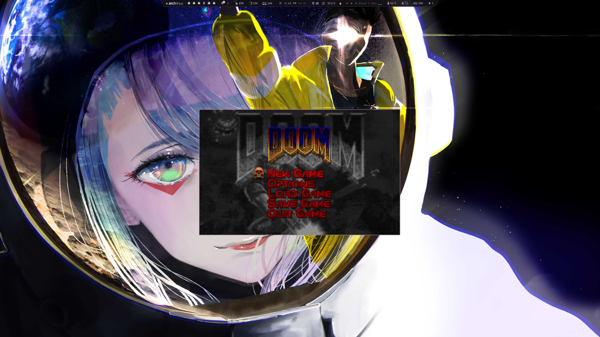

# omarchy-doom



**Everything should have Doom.**

A bar widget for Omarchy/Quickshell that launches Doom. Click the skull, rip and tear.

## Install

```bash
cd ~/Work/omarchy-doom && ./install.sh
```

The install script handles everything:
- Installs `doomretro` if not present
- Creates `~/.config/doomretro/doomretro.cfg` with windowed defaults
- Adds a floating window rule to `~/.config/hypr/hyprland.lua`
- Copies plugin to `~/.config/omarchy/plugins/com.user.doom/`

## WAD Files

You need a Doom IWAD file to play. The plugin auto-scans:
- `~/Games/doom/`
- `~/doom/`
- `~/.local/share/doom/`
- `/usr/share/doom/`

### Where to get WAD files

- **DOOM (1993)** and **DOOM II** - Buy on [Steam](https://store.steampowered.com/app/2280/DOOM_II/) or [GOG](https://www.gog.com/game/doom_ii)
- **Shareware DOOM1.WAD** - Freely available, search "DOOM1.WAD shareware download"

Place your WAD in `~/Games/doom/` or set the path in widget settings.

If you have multiple WADs, the plugin picks the first one found (alphabetically). Set a specific path in widget settings to choose a different one (e.g., DOOM2.WAD).

## Controls

- **Left click** the skull to launch Doom
- **Left click** again while running to kill it
- Icon changes to fire while Doom is active

## Configuration

Edit `shell.json` or click the widget for settings:

- **binary**: Doom binary path (default: `doomretro`)
- **wad**: WAD file path (leave empty for auto-detect)
- **extraArgs**: Additional arguments (e.g., `-nosound`)

## Supported Ports

Any SDL2-based Doom source port works:
- `doomretro` · `woof` · `chocolate-doom` · `dsda-doom` · `prboom` · `gzdoom`

## Uninstall

```bash
cd ~/Work/omarchy-doom && ./uninstall.sh
```

Removes plugin, window rule, and optionally WADs and doomretro.
